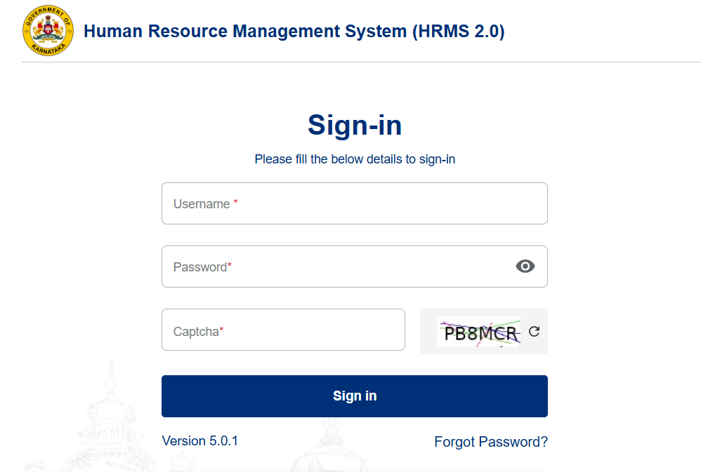
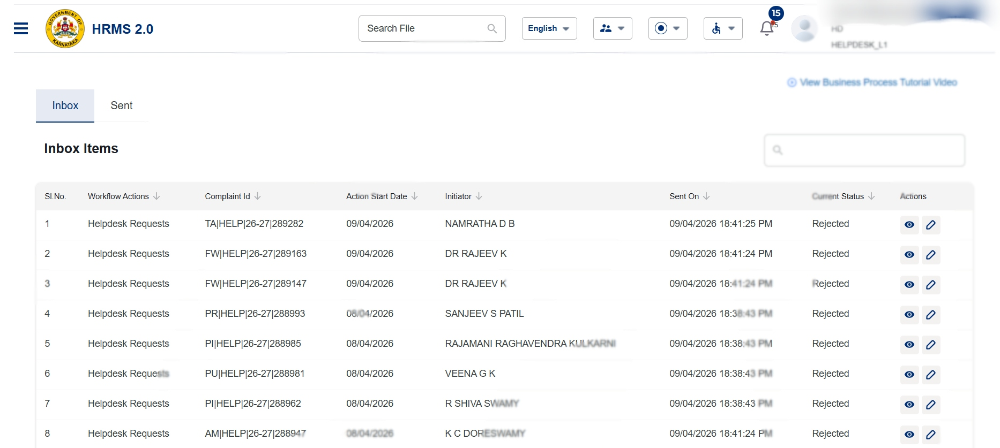
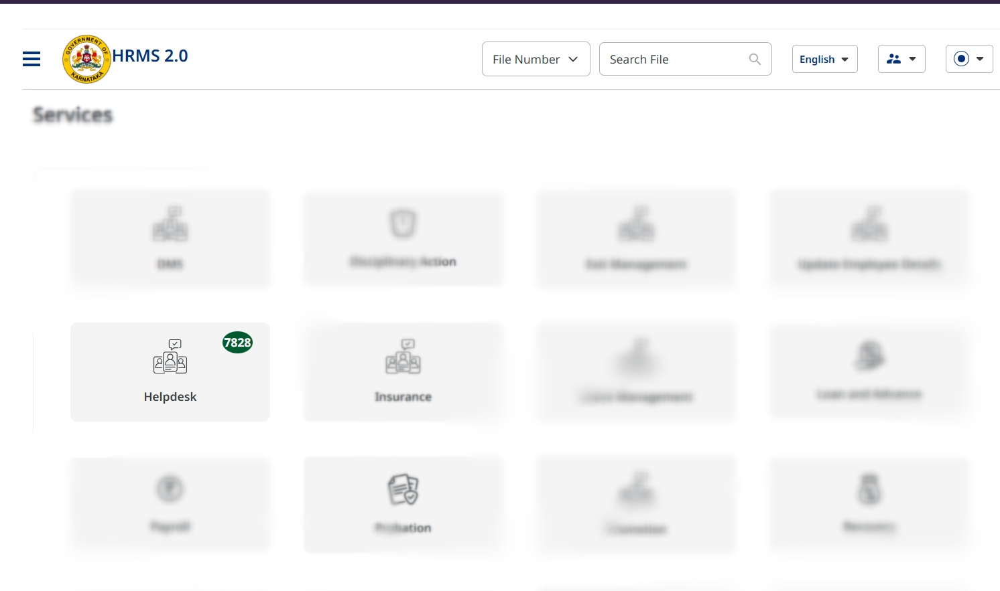

# HRMS 2.0 Autonomous Ticket Processor

This repo contains a Node.js bot for the Karnataka HRMS 2.0 portal. It automates login, local captcha solving, OTP verification, and Helpdesk ticket processing for L1 workflow items.

## Screenshots







## Captcha storage

Captured captcha images are now saved to `Photo/captchas/` during login attempts, so the repo root stays clean and all generated bot assets are stored in one place.

## What this bot does

- Logs into the HRMS portal using configured credentials.
- Downloads the captcha image, enhances it with `sharp`, and reads the text with `tesseract.js`.
- Enters OTP values across multiple input boxes and submits verification.
- Opens the Helpdesk module and polls the ticket queue.
- Processes tickets automatically by posting the configured action payload.

## Why this is useful

This automation is designed for basic HRMS Helpdesk ticket handling in a repeatable loop, reducing manual work for L1 support users. It uses only local OCR and browser automation, with no paid captcha service.

## Requirements

- Node.js 18 or newer.
- Installed Google Chrome.
- A `.env` file in the project root with `HRMS_USER`, `HRMS_PASS`, and `HRMS_OTP`.

## Installation

```bash
git clone <your-repo-url>
cd hrms-autobot
npm install
```

## Configuration

Create `.env` with values for your account:

```env
HRMS_USER=your_username
HRMS_PASS=your_password
HRMS_OTP=123456
```

> Do not commit `.env` to source control.

## Run the bot

```bash
node bot.js
```

Stop the bot with `Ctrl+C`.

## How it works

1. Open the login page and fill username/password.
2. Capture the displayed captcha image.
3. Preprocess the image with `sharp` and recognize text with `tesseract.js`.
4. Submit login, then fill OTP inputs and verify.
5. Open the Helpdesk module.
6. Poll the inbox API, then process each ticket with the current hardcoded payload.

## Customization

The business rules and ticket payload are defined inside `bot.js` within the browser page context. Common values to adjust include:

- `actionTaken`
- `notes`
- `officeCode`
- `actorCode`
- `roleCode`
- intray module path

If the captcha format changes, update the image preprocessing steps in `solveCaptcha`.

## Troubleshooting

- Chrome not found: install Chrome and ensure it is available on your system.
- Captcha fails: tune the `sharp` preprocessing or increase the retry limit.
- OTP fails: confirm `HRMS_OTP` matches the portal’s OTP input fields.
- Queue empty: the bot waits and retries after a short delay.

## Notes

- This bot performs real actions in the HRMS portal. Use only with proper authorization.
- Keep credentials secret and do not share `.env` values.

## License

ISC

## Tech stack

- Node.js
- Puppeteer
- dotenv
- Sharp
- Tesseract.js
